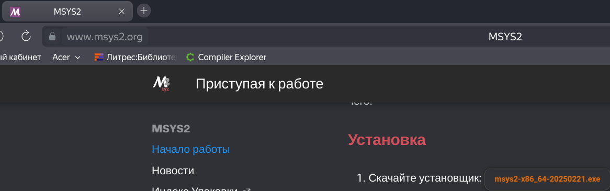

# Компилятор GCC. Первая программа на Windows

## Установка компилятора

Рассмотрим создание первой простейшей программы на языке Си с помощью компилятора GCC, который на сегодняшний день является одим из наиболее популярных компиляторов для Cи и который доступен для разных платформ. Более подобному информацию о GCC можно получить на официальном сайте проекта [GCC](https://gcc.gnu.org/).

Набор компиляторов GCC распространяется в различных версиях. Для Windows одной из наиболее популярных версий является пакет средств для разработки от некоммерческого проекта MSYS2. Следует отметить, что для MSYS2 требуется 64-битная версия Windows 7 и выше (то есть Vista, XP и более ранние версии не подходят)

Итак, загрузим программу установки MSYS2 с официального сайта MSYS2:



После загрузки программы, просто следуем инструкции на сайте MSYS2.

Далее, запускаем UCRT64, наблюдая как запускается эмулятор терминала и вводим команду:

```bash
pacman -S mingw-w64-ucrt-x86_64-gcc
```

В окне терминала отобразится результат, как показано ниже. Для продолжения нажмите «Enter»:

```bash
resolving dependencies...
looking for conflicting packages...

Packages (15) mingw-w64-ucrt-x86_64-binutils-2.41-2
            mingw-w64-ucrt-x86_64-crt-git-11.0.0.r216.gffe883434-1
            mingw-w64-ucrt-x86_64-gcc-libs-13.2.0-2  mingw-w64-ucrt-x86_64-gmp-6.3.0-2
            mingw-w64-ucrt-x86_64-headers-git-11.0.0.r216.gffe883434-1
            mingw-w64-ucrt-x86_64-isl-0.26-1  mingw-w64-ucrt-x86_64-libiconv-1.17-3
            mingw-w64-ucrt-x86_64-libwinpthread-git-11.0.0.r216.gffe883434-1
            mingw-w64-ucrt-x86_64-mpc-1.3.1-2  mingw-w64-ucrt-x86_64-mpfr-4.2.1-2
            mingw-w64-ucrt-x86_64-windows-default-manifest-6.4-4
            mingw-w64-ucrt-x86_64-winpthreads-git-11.0.0.r216.gffe883434-1
            mingw-w64-ucrt-x86_64-zlib-1.3-1  mingw-w64-ucrt-x86_64-zstd-1.5.5-1
            mingw-w64-ucrt-x86_64-gcc-13.2.0-2

Total Download Size:    49.38 MiB
Total Installed Size:  418.82 MiB

:: Proceed with installation? [Y/n]
[... downloading and installation continues ...]
```

Теперь вы можете вызвать gcc для создания программного обеспечения для Windows.

```bash
gcc --version
```

После установки MSYS2 обновится автоматически через ```pacman```, см. [руководство по обновлению](https://www.msys2.org/docs/updating/) для получения дополнительной информации.
